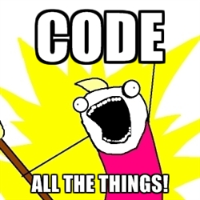
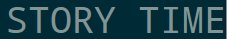

% An Introduction to Python for Programmers

```python
from pprint import pprint

if __name__ == '__main__':
    meta = {
        'author': 'Alejandro Cabrera',
        'office': 'Racklanta',
        'objective': 'Level Up!'
    }
    pprint(meta)
```

This Presentation is...
=============


Overview
========

* Conventions
* Syntax
* Style & Idioms
* Tools of the Trade

(Un-Overview) The Juicy Parts
========

* Sweet, Sugary Syntax
* Python Code You Don't Want to C
* Comprehension Power
* Thinking with Contexts
* Get Decorative (not in this talk)
* Python 2 -> Python 3 -> ...
* I Once Knew a Pip
* Hack the Stack on the Rack
* Going Even Further

Conventions: Python Terminal
===========

```python
>>> # This is a comment and a Python terminal
>>> # 3: This applies to Python 3 only
>>> # 2: This applies to Python 2 only
>>> 'I am some code to type'
'I am some code to type'
```

Conventions: Shell Terminal
===========

```bash
# This is a shell terminal
$> this-is-a-command
I am the command output

Finished in 10s
```

Conventions: Python File
===========

```python
"""This is a Python file"""
# file-name.py
import os # module import

def computation_time():
    pass
```

Syntax: What's Common
======

Python syntax is similar to C, C++, C#, and Java.

> * Arithmetic operators: ```+, -, *, /```
> * Bit-wise Operations: ```<<, >>, &, |, ^, ~```
> * Assign: ```=, +=, -=, *=, /=, <<=, >>=, &=, |=, ^=```
> * Compare: ```==, !=, <, >, <=, >=```

Syntax: What's Common
======

Conditional logic is very similar.

```python
if x > 10:
    x = 10
elif x < 0:
    x = 0
else:
    x += 1
```

Syntax: What's Common
======

Looping isn't too far off, either.

```python
while (index != 0):
    index -= 1

for i in [1,2,3]:
    print(i)

while (True):
    i += 1
    if i == 10:
        continue
    elif i == 12:
        break
```

Syntax: What's Different
======

All numbers are BigInts (if they need to be), and there's an exponentation operator.

```python
>>> 2 ** 32
4294967296
>>> 2 ** 32 ** 32
179769313486231590772930519078902473361797
697894230657273430081157732675805500963132
708477322407536021120113879871393357658789
768814416622492847430639474124377767893424
865485276302219601246094119453082952085005
768838150682342462881473913110540827237163
350510684586298239947245938479716304835356
329624224137216
```

Syntax: What's Different
======

Multiple assignment is allowed (and idiomatic!):

```python
a, b = 1, 2 # a = 1, b = 2
a, b = b, a # swaps a and b
```

Syntax: What's Different
======

Logical operators are all keywords (they still short-circuit):

```python
if (x < 0 and x > 10 or y > 10):
    print('Pass!')
```

Syntax: What's Different
======

White-space matters - a lot.

```python
if take == 1:
  print('1')
   print('2') # error, mismatched indent

if take == 2:
  print('1')
  else: # error, no opening if
    print('2')

if take == 3:
  print('1')
else:
   print('2') # error, mismatched indent
```

Syntax: What's Different
======

Types are decided at run-time, and are very flexible:

```python
a = 1
a = False
a = True
a = []
a = 'stringy'
a = lambda x: x + 1
```

Syntax: What's Different
======

Ternary operator uses keywords:

```python
x = 0 if x < 0 else 10
print('Command') if my_condition() else quit()
```

Syntax: What's Different
======

There is no difference between a string and a character literal. Also, strings
are immutable and are all objects.

```python
'' # The empty string
'1' # A one-character string
"" # The same empty string as above
"""A multi
line
string"""
```

Syntax: What's Different
======

There is no difference between a string and a character literal. Also, strings
are immutable and are all objects.

```python
>>> assert '' == ""
>>> x = 'cat'
>>> x[2] = 'r' # Exception!
Traceback (most recent call last):
  File "<stdin>", line 1, in <module>
TypeError: 'str' object does not support item assignment
>>> 'I am a cat'.split()
['I', 'am', 'a', 'cat']
>>> len('')
0
>>> ' aa '.strip()
'aa'
```

Syntax: What's Different
======

Lists, dictionaries, tuples, and sets are all built in:

```python
my_list = [1, 2, 3, 4]
my_set = {1, 1, 2, 2} # -> {1, 2}
my_dictionary = {1: 'a', 2: 'b', 'meta': 'maybe'}
my_tuple = (1,)
my_complex_beast = {('2', 'H'): [23], ('4', 'D'): 134}
```

As are Booleans: ```True, False```

There's even a built-in null type: ```None```

Syntax: What's Different
======

Slices are built in, too! Lists and strings support slicing.

```python
>>> # [start : stop : step]
>>> x = [1, 2, 3, 4, 5, 6]
>>> x[:]
[1, 2, 3, 4, 5, 6]
>>> x[:2]
[1, 2]
>>> x[2:]
[3, 4, 5, 6]
>>> x[-1] # negative sequences are pretty handy
6
>>> x[1:5:2]
[2, 4]
```

Syntax: What's Different
======

Defining a function is a little different...

```python
def wants_answers():
    return False


def send_msg(from, to, msg):
    print(from, ' says ', msg, ' to ', to)


def the_answer(a, b, c):
    return 42

my_func = the_answer if wants_answers() else send_msg
my_func('me', 'you', 'function assignment!')
```

Syntax: What's Different
======

There's all kinds of [built-in](http://docs.python.org/3/library/functions.html) functions that give your
Python super powers:

```python
>>> x = [4, 2, 3, 1]
>>> sorted(x)
[1, 2, 3, 4]
>>> reversed(x)
[1, 3, 2, 4]
>>> sum(x)
10
>>> len(x)
4
```

Syntax: What's Different
=====

```python
>>> range(0, 10, 2)
range(0, 10, 2)
>>> open('talk.md')
<_io.TextIOWrapper name='talk.md' mode='r'
encoding='UTF-8'>
>>> str(1)
'1'
>>> int('1')
1
>>> chr(33)
'!'
>>> ord('!')
33
```

How About a Little Bit of Python?
======

...

How About a Little Bit of Python?
======


The Python Way
======

Python has a very opinionated community. You'll hear about things like:

> "The API is all that matters - everything else is secondary." - Kenneth Reitz

> "There should be one - and preferably only one - obvious way to do it" - Tim Peters, the Zen of Python

The Python Way
======

Learn the Python way, and your road to Python mastery will be a glorious one!



The Python Way
======

Leave behind your C-like patterns lest you experience... the unmaintainable!

```python
new_gpio = (MB_IN8(bay, KL_GPIO_MEDIABAY_IRQ) & 
           KEYLARGO_GPIO_INPUT_DATA)
if new_gpio:
  bay.cached_gpio = new_gpio
  return MB_NO
elif bay.cached_gpio != new_gpio:
  MB_BIS(bay, KEYLARGO_MBCR, KL_MBCR_MB0_ENABLE)
  MB_IN32(bay, KEYLARGO_MBCR)
  udelay(5)
  MB_BIC(bay, KEYLARGO_MBCR, 0x0000000F)
  MB_IN32(bay, KEYLARGO_MBCR)
  udelay(5)
  bay.cached_gpio = new_gpio
```

The Python Way
=====

> No kernel programmers were harmed in the making of the previous slide.

The Python Way
=====

Some general tips:

> * Beautiful is better than ugly - keep your code readable, simple, organized
> * Be explicit - let readers know where you import from, what exceptions you catch
> * Errors should never pass silently - crash hard if you need to
> * If the implementation is hard to explain, it's a bad idea
> * Don't reinvent the wheel - Python comes with Batteries Included™

The Python Way
=====

Some mechanics (with examples!):

> * Master the REPL - dir(), help(), and _ - iterate quickly!
> * Comprehensions are magical - they'll keep your code short and fast
>     - But don't get carried away - be practical
> * Use ```in``` when you want to know if an element is in a collection
> * Remember the meaning of Truth, and use it wisely
> * Learn about, use, and write your own context managers

REPL Time
=====

**dir**, **help**, **_**: this trio will get you very far, even without a Google.

```python
>>> import contextlib
>>> dir(contextlib)
['ContextDecorator', 'ExitStack',
'_GeneratorContextManager', '__all__', '__builtins__',
'__cached__', '__doc__', '__file__', '__initializing__',
'__loader__', '__name__', '__package__', 'closing',
'contextmanager', 'deque', 'sys', 'wraps']
>>> help(contextlib)
...
>>> 1 + 1
2
>>> _
2
```

REPL Time: Reloaded
=====

Check out [ipython](http://ipython.org)

It's a hyper-enhanced version of the Python shell that also gives you:

> * Auto-completion
> * Simpler **help** - just use <name>**?** instead of **help**(name)
> * Built-in data plotting support
> * Much more

Why I Switched to Python: Comprehensions
=====

Comprehensions are one of Python's most powerful features. With support for:

* Lists
* Sets
* Dictionaries
* Generators (kind of incremental lists, not covered)

... you'll find you need loops a lot less than in other languages.

Level 1: List Comprehensions
====

Need a list of all the odd numbers less than 100?

```python
>>> [i for i in range(100) if i % 2]
[1, 3, 5, 7, 9, 11, 13, 15, 17, 19, 21, 23, 25, 27, 29,
31, 33, 35, 37, 39, 41, 43, 45, 47, 49, 51, 53, 55, 57,
59, 61, 63, 65, 67, 69, 71, 73, 75, 77, 79, 81, 83, 85,
87, 89, 91, 93, 95, 97, 99]
>>> # Replaces this
>>> odds = []
>>> for i in range(100):
...     if i % 2:
...         odds.append(i)
```

Level 2: Set Comprehensions
====

Need all the unique characters in a message that aren't 'a' or 'i'?

```python
>>> msg = 'siwdnfoweidnwsosaasinsoinwsodnw'
>>> {i for i in msg if i != 'a' and i != 'i'}
{'w', 's', 'f', 'd', 'e', 'n', 'o'}
```

Level 3: Dictionary Comprehensions
=====

Need to cache the name of every file in a directory with metadata included if it
isn't a log file?

```python
>>> import os
>>> {f: os.stat(f) for f in os.listdir('.') if not
...  f.endswith('.log')}
{'talk.html': posix.stat_result(st_mode=33204,
st_ino=4997634, st_dev=2054, st_nlink=1, st_uid=1000,
st_gid=1000, st_size=87902, st_atime=1358996255,
st_mtime=1358996254, st_ctime=1358996254), ...
```

Level 4: Comprehending Comprehensions
=====


(If not, go [here](http://docs.python.org/2/tutorial/datastructures.html#list-comprehensions))

Are You in My Collection?
=====

The ```in``` operator makes it easy to ask questions of built-in data structures.

```python
>>> tools = ['python', 'pip', 'tox', 'emacs']
>>> 'vim' in tools
False
>>> tools_meta = ['python': 3, 'tox': 1]
>>> 'python' in tools_meta
True
>>> 3 in tools_meta
False
>>> 3 in tools_meta.values()
True
```

The Truth
=====

Taking advantage of implicit truth values can make your code easier to read.

```python
>>> # What is False?
>>> [bool(i) for i in [[], (), 0, {}, False, '', None]]
[False, False, False, False, False, False, False]
>>> if mylist:
...     mylist.pop()
>>> # Replaces
>>> if len(mylist) > 0:
...     mylist.pop()
>>> if mylist is not []:
...     mylist.pop()
```


Context Managers: What? Where?
=====

I'll say very little on [context
managers](http://python3porting.com/improving.html#coding-with-context-managers). Think
of them as RAII if you come from a C++ background, or
```finally``` blocks otherwise.

Context Managers: with
=====

Opening/and closing a file using context managers:

```python
>>> data = None
>>> with open('my-text.md', 'r') as f:
...     data = f.readlines()
```

Context Managers: without
=====

... and again, without:

```python
>>> data = None
>>> try:
...     f = open('x', 'r')
...     data = f.readlines()
... finally:
...     f.close()
...
>>>
```

The Tools
=====


The Tools
=====

Here's the line up:

* [pep8](http://pypi.python.org/pypi/pep8)
* [autopep8](http://pypi.python.org/pypi/autopep8)
* [pylint](http://pypi.python.org/pypi/pylint)
* [pip](pip-installer.org)
* [tox](http://pypi.python.org/pypi/tox)
* [nose](http://pypi.python.org/pypi/nose/1.2.1)
* [virtualenv](http://pypi.python.org/pypi/virtualenv)
* ...

The Tools You'll Actually Use Today
=====

* [pip](pip-installer.org)
* [pep8](http://pypi.python.org/pypi/pep8)
* [autopep8](http://pypi.python.org/pypi/autopep8)
* [pylint](http://pypi.python.org/pypi/pylint)

The Tools: pip
=====

pip - the canonical Python installer. Think: gem, npm, apt-get

Install it in two steps:

1. Install [easy_install](http://pypi.python.org/pypi/setuptools)
2. Install pip:

```bash
$ easy_install pip
```

Every tool that follows can now be installed using:

```bash
$ pip install <name>
```

The Tools: pep8
=====

pep8 - it will tell you what about your code syntax/formating isn't Python-worthy.

```python
# my.py
def my_fun_function(x,y,z):
   print ( 'you see?', 1+1, x+y*z)
```

The Tools: pep8
=====

```bash
$ pep8 my.py
pep8 my.py 
my.py:2:1: E302 expected 2 blank lines, found 0
my.py:2:22: E231 missing whitespace after ','
my.py:2:24: E231 missing whitespace after ','
my.py:3:11: E201 whitespace after '('
my.py:3:4: E111 indentation is not a multiple of four
my.py:3:9: E211 whitespace before '('
my.py:4:1: W391 blank line at end of file
```

The Tools: autopep8
=====

Think of autopep8 as 'the quick fix' that's also safe and awesome.

```bash
$ autopep8 -i my.py
$ pep8 my.py
$ 
```

The Tools: pylint
=====

pylint - static analysis for Python programs

See for yourself. It even scores your programs!

Just One Third-Party Module...
=====

Requests. Requests. [Requests](http://docs.python-requests.org/en/latest/).

```bash
$ pip install requests
```

```python
>>> import requests
>>> resp = requests.get('https://rse.drivesrvr.com/health')
>>> resp.headers
{'date': 'Thu, 24 Jan 2013 06:50:57 GMT', 'connection':
'keep-alive', 'content-length': '3', 'server':
'gunicorn/0.13.4'}
>>> resp.content
'OK\n'
```

Now For Something Completely Different...
=====

Python is Evolving
======


Python is Evolving
=====



(Breaking) Changes in Python 3
=====

* Everything is unicode
    - This will break all of your code
* print is now a function, not a statement
* All classes are new-style
* / gives a floating point result by default
* Exception syntax updated
* raw_input() -> input()
* Even more changes across library APIs

OpenStack and Python 3
=====

> After PyCon 2012, it's clear than Python 3 is here, and
  we need to starting thinking about it. It's also clear
  this isn't happening in Folsom. This is a big effort,
  and we should probably start planning sooner rather than
  later. - Open Stack Summit 2012

Going Beyond This Talk
=====

Some pointers:

* Read our [Idiomatic Python Guide](https://one.rackspace.com/download/attachments/33393498/idiomatic-python.pdf)
* Read the Python official [docs](http://docs.python.org/3.3/)
* Read [The Hitchhiker's Guide to Python](https://python-guide.readthedocs.org/en/latest/)
* Watch some [inspiring](http://www.youtube.com/watch?v=Y97D8j6CAog), [opinionated](http://www.youtube.com/watch?v=o9pEzgHorH0), and [interesting](https://us.pycon.org/2012/schedule/) Python videos
* Get a poster of [The Zen of Python](http://www.python.org/dev/peps/pep-0020/)
* Learn to [Code Like a Pythonista!](http://python.net/~goodger/projects/pycon/2007/idiomatic/handout.html)
* Participate in a Rackspace Hackday!

Thanks
=====

```python
while (True)
    os.sleep(1)
    print('Thank you!')
```
